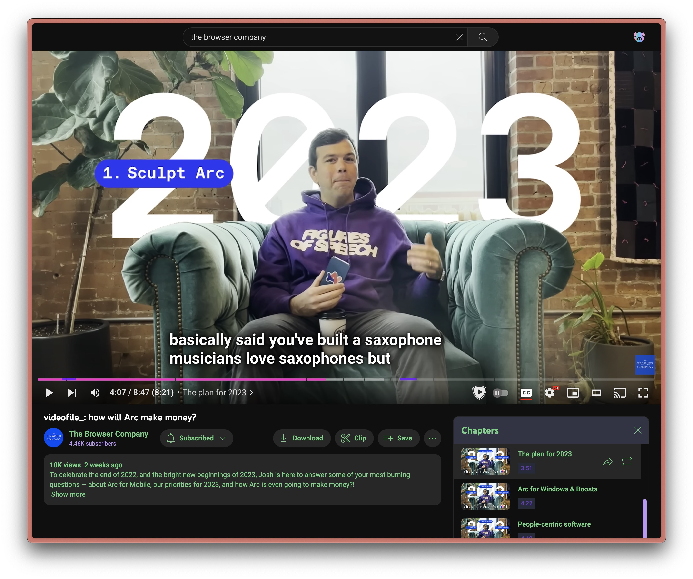

  <h1>Minimal YouTube</h1>

Minimal YouTube is a boost for the <a href="https://arc.net/">Arc browser</a> that replaces the YouTube UI with a minimal design containing no recommendations, shorts, or distractions.

  

  

# Installation
* Open https://youtube.com/ in Arc
* Click the + button to create a new Boost
* Select "Custom"
* Replace `styles.css` and `content.js` with the contents of the repo
* Profit

# New features in this fork
* Bigger subtitles
* Bigger timestamp and chapter title
* Bigger timeline
* Bigger search bar on home page
* Links to watch later and subscriptions on home page
* Dracula color scheme
* Redirect shorts to regular video player
* Adds back YouTube profile icon